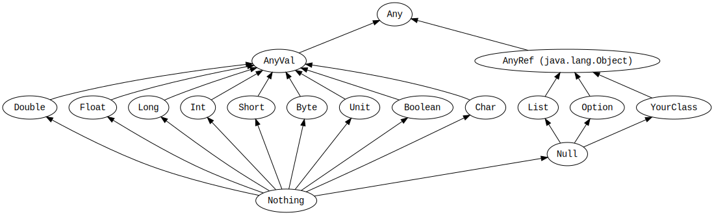

# Унифицированные типы



`Any` - это супертип для всех типов, также называемый "верхним" типом. Он определяет несколько универсальных методов вроде `equals`, `hashCode`, `toString`. У него есть два прямых субкласса: `AnyVal` и `AnyRef`.


## AnyVal

**AnyVal** представляет типы значений (которые передаются по значению). В Scala **девять** предсозданных типов значений, и все они **non-nullable**:
- Double;
- Float;
- Long;
- Int;
- Short;
- Byte;
- Char;
- Unit;
- Boolean.

`Unit` - это тип значения, который не несёт значащей информации. Есть ровно один инстанс Unit, и его можно вызвать вот так: `()`. В Scala **все функции должны возвращать хоть что-то**, поэтому Unit часто бывает незаменим.

## AnyRef

**AnyRef** представляет ссылочные типы (которые передаются по ссылке). Все non-value типы являются ссылочными. Каждый кастомный тип в Scala - это подтип **AnyRef**. Если Scala используется в контексте Java runtime environment, AnyRef соответствует `java.lang.Object`.

Следующий пример демонстрирует, что все строки, целочисленные, символы и булевы значения являются объектами как и любой другой просто объект:

```scala
object Main extends App {
  val list: List[Any] = List(
    "a string",
    632,
    4.20,
    true,
    'c',
    () => "anonymous function returning a string"
  )

  list.foreach(element => println(element))
}
```

Этот код определяет лист значений с типом List[Any]. Этот лист проинициализирован элементами различных типов, но каждый из них -это инстанс scala.Any, поэтому можно добавлять их в такой лист.


# Приведение типов

Value типы могут быть приведены следующими путями:


Видно, что приведение происходит от меньшего к большему.

```scala

class TypeCasting {

  def testCasting: Unit = {
    val x: Long = 987654321
    val y: Float = x //9.8765434E8

    val face: Char = '☺'
    val number: Int = face // 9786 

    val xx: Long = 987654321
    val yy: Float = xx
    // приведение большего к меньшему вызывает ошибку
    //val zz: Long = yy

    }
}
```

Ещё можно проводить каст ссылочного типа к подтипу. 


# Nothing и Null

`Nothing` - это подтип для всех типов, ещё его называют **bottom (нижний) тип**. Не существует значения, которое имеет тип Nothing. Обычное его использование - это сигналировать о незавершении (например, выброшенном исключении, выходе программы или бесконечном цикле). Иными словами, это тип для выражения, которое не удаётся приравнять к значению или для метода, который не вызвает `return` нормальным образом.

На самом деле, его можно вызвать литералом `???`. При его вызове произойдёт исключение `NotImplemented`. Его можно ставить как заглушку.

```scala
try {
  // some code
} catch {
  case e: SomeException => ???
  case e: SomeOtherException => ???
} finally {
  // some code
}
```


`Null` - это подтип всех ссылочных типов (т.е. для всех подтипов `AnyRef`). У него есть единственное значение, идентифицируемое литералом `null`. Null существует по большей части для совместимости с другими JVM-языками и никогда не должен быть использован в Scala. 

У null есть альтернатива, которая будет разобрана позже в этом туре.


