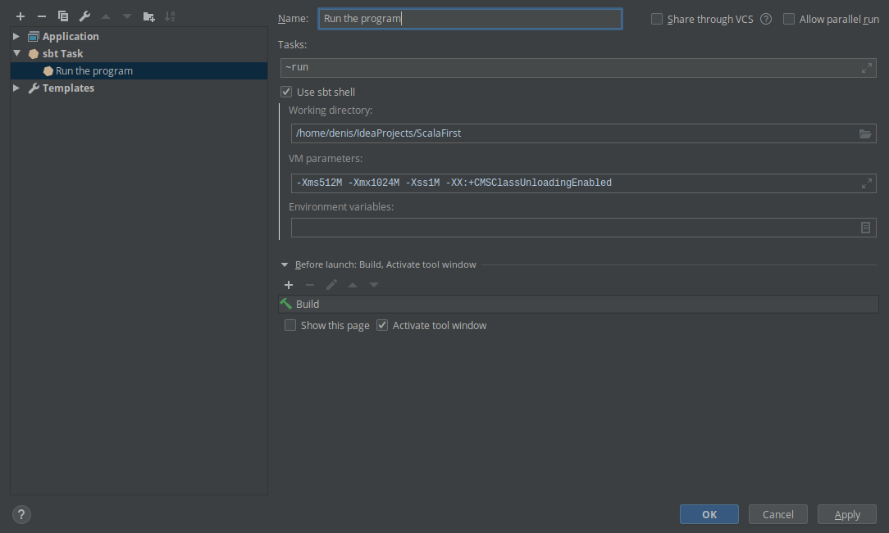

### Создание проекта в Intellij IDEA

Для создания проекта в IDEA нужно щёлкнуть ПКМ и выбрать **Add framework support...**, а затем выбрать SCALA. В проекте используется два вида файлов - класс Scala с расширением .scala *Hello.scala* и worksheet Mathematician.sc.

# Билды проекта

## Из командной строки

**sbt** - это популярное средство компиляции, запуска и тестирования проектов Scala любого размера. Использование такого средства (или Maven/Gradle) становится необходимым когда происходит сборка проектов больше, чем с одним файлом.

Из командной строки sbt использовать легко:

- Перейти в пустой фолдер;
- `sbt new scala/hello_world.g8`. Эта команда притащит шаблон hello-world с GitHub и создаст фолдер target;
- Ввести имя приложения, будет создан проект с таким именем;

Получится подобная структура:

```
hello-world
    project (тут менеджатся плагины и зависимости)
        build.properties
    src
        main
            java (да, может быть и код Java тут)
            scala-2.12 (специфичный код для версии 2.12)
            scala (весь код SCALA тут)
                Main.scala (входная точка программы)
    build.sbt (sbtшный файл-определение билда)
```

Дальше можно запустить sbt в консоли. В нём есть утилита `~run`, которая будет обновлять каждый код при изменении и выводить в консоль при каждом сохранении.

### Добавление зависимости

В **build.sbt** добавить строчку:

```
libraryDependencies += "org.scala-lang.modules" %% "scala-parser-combinators" % "1.1.2"
```

Здесь **libraryDepencencies** - это набор зависимостей и испротзуя оператор `+=` мы добавляем зависимость *scala-parser-combinators* к набору зависимостей, которые sbt будет проходить и собирать каждый раз при старте. Теперь в файлах Scala можно импортить классы, объекты и всё такое из *scala-parser-combinators* с обычным `import`.

А ещё библиотеки есть на **Scaladex**.


## Из IDEA

Создадим класс Main.scala:

```scala
object Main extends App {
  val ages = Seq(42, 75, 29, 64)
  println(s"The oldest person is ${ages.max}")
}
```

*Кстати, у IntelliJ свой компилятор Scala, поэтому иногда код может выполняться в sbt и не выполняться в IDEA.*

### Запуск кода

- Из Run выбрать Edit configurations;
- Нажать + и выбрать **sbt Task**;
- Назвать его `Run the program`;
- В поле **Tasks** вписать `~run`. `~` заставляет sbt пересобирать и перезапускать проект когда меняется файл;
- Нажать OK;
- В меню Run выбрать **Run the program**.



### Добавление зависимости

Добавление зависимостей происходит через **build.sbt**, как и описано выше.


