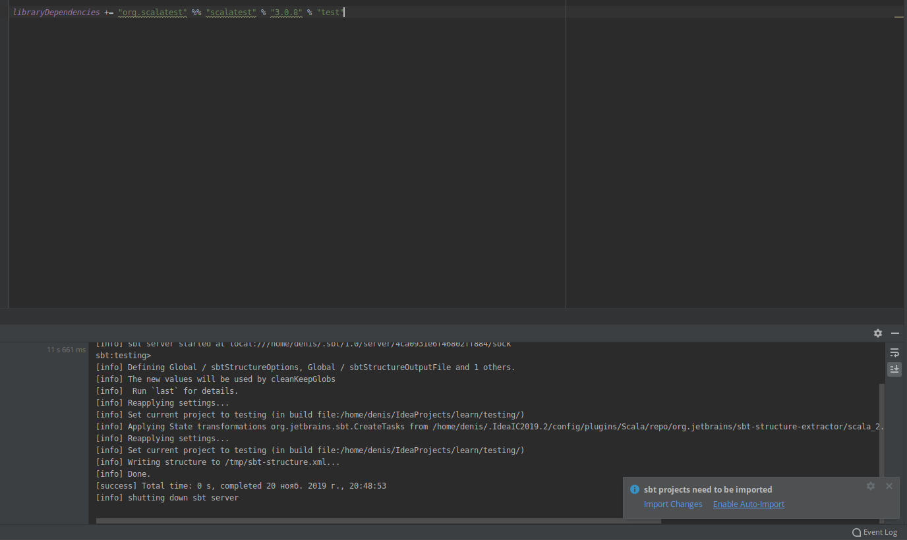
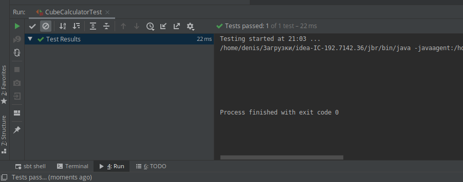

, # Тестирование проектов

Существует несколько методик тестирования, но в [туториале](https://docs.scala-lang.org/getting-started/intellij-track/testing-scala-in-intellij-with-scalatest.html) будет описана одна популярная опция из **ScalaTest**, называемая **FunSuite**.

## Установка

Нужно прописать зависимость в build.sbt:

```
libraryDependencies += "org.scalatest" %% "scalatest" % "3.0.8" % "test"
```

После этого штука попросит импортировать приколюхи (справа внизу). Я поставил автоматический импорт.



Теперь создадим объект **CubeCalculator**:

```scala
object CubeCalculator extends App {
  def cube(x: Int) = {
    x * x * x
  }
}
```

## Создание теста

Тесты создаются в src/test. Нужно создать *класс* (**ВНИМАНИЕ, ДА, КЛАСС, А НЕ ОБЪЕКТ В ЭТОТ РАЗ**), расширяющий FunSuite:

```scala
import org.scalatest.FunSuite

class CubeCalculatorTest extends FunSuite{
  test("CubeCalculator.cube") {
    assert(CubeCalculator.cube(3) === 27)
  }
}

```

Теперь можно нажать ПКМ прямо на классе и выбрать Run.



Тест завершился успешно.

## Разбор кода

Да тут всё элементарно.

- Вроде бы название можно любое, но правильный стиль для объекта CubeCalculator это CubeCalculatorTest;

- extends FunSuite означает, что мы наследуемся от FunSuite, чтобы использовать такой функционал как метод test;

- test - это функция, которая приходит из библиотеки FunSuite и содержит результаты ассертов;

- CubeCalculator.cube - имя теста, можно **любое**, но соглашение здесь **ClassName.methodName**;

- assert - ну тут понятно, берёт булево и смотрит, прошёл тест или провалился;

- CubeCalculator.cube(3)===27 проверяет вывод. `===` - это часть либы ScalaTest и даёт чистые error сообщения.

## Ещё примерчик

```scala
import org.scalatest.FunSuite

class CubeCalculatorTest extends FunSuite{
  test("CubeCalculator.cube") {
    assert(CubeCalculator.cube(3) === 27)
    assert(CubeCalculator.cube(0) === 0)
  }

}
```


